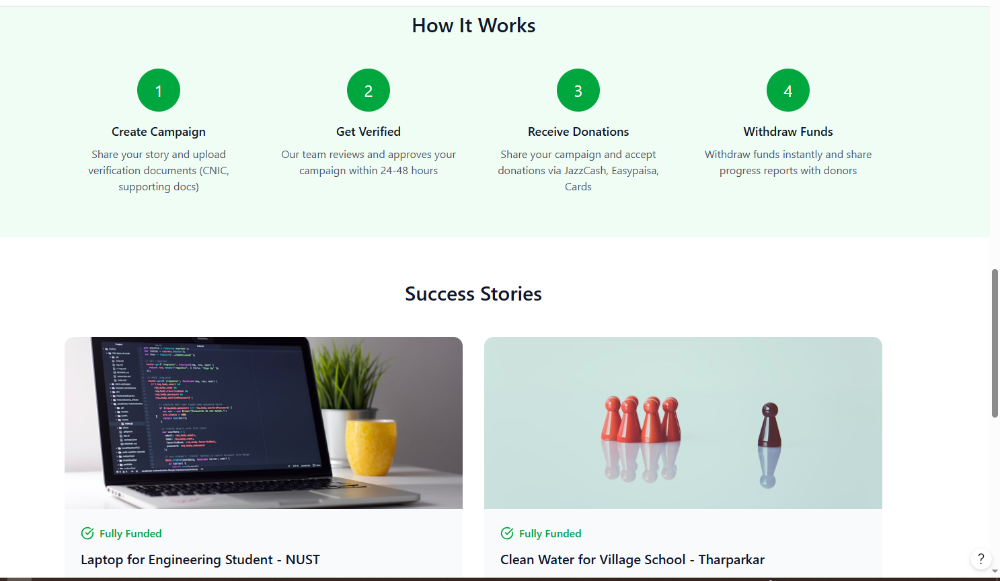
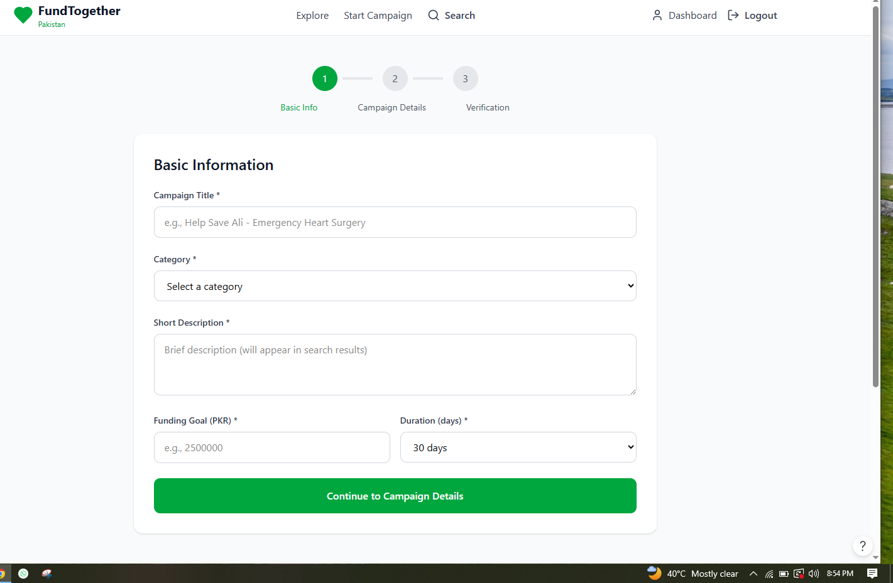
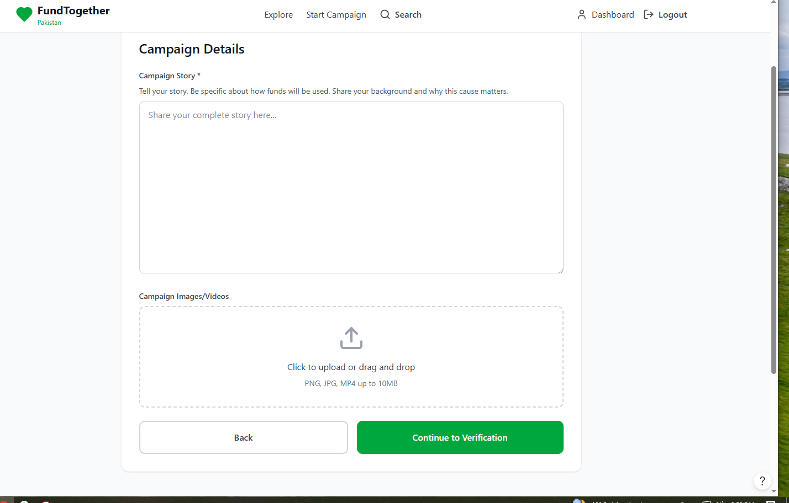
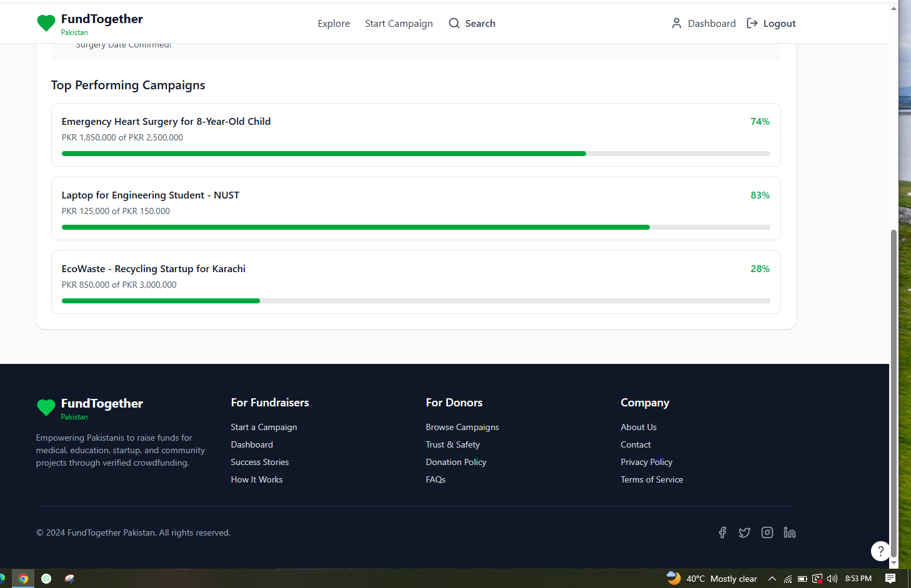

# fundtogether-Pakistan5
FundTogether Pakistan
Project Overview

FundTogether Pakistan is a web-based crowdfunding platform designed to provide a secure, transparent, and accessible fundraising solution for individuals and organizations across Pakistan. The platform enables students, patients, startups, NGOs, small businesses, and community groups to raise funds from the public through verified fundraising campaigns. By integrating campaign verification, fund usage reporting, and local payment methods, FundTogether Pakistan aims to build trust between fundraisers and donors while promoting social welfare, education, healthcare, entrepreneurship, and community development.

System Architecture

The system follows a modern three-tier architecture consisting of:

Frontend: Next.js and Tailwind CSS
Backend: Node.js and Express.js
Database: PostgreSQL
Storage: Cloudinary / AWS S3
Payment Gateways: JazzCash, Easypaisa, and Stripe
Hosting: Vercel and AWS
Data Flow

User → Frontend (Next.js) → Backend API (Node.js/Express) → PostgreSQL Database → Payment Gateways → Response to User

Database Design

The platform uses PostgreSQL as its relational database management system. The main database entities include:

Users
Campaigns
Categories
Donations
Payments
Campaign Updates
Comments
Documents
Notifications
Withdrawals
Fund Usage Reports

The database is designed to maintain secure relationships between users, campaigns, donations, and payment records while ensuring data integrity and transparency.

User Roles
Fundraiser
Create fundraising campaigns
Upload verification documents
Track donations
Post campaign updates
Request fund withdrawals
Submit fund usage reports
Donor
Browse fundraising campaigns
View campaign details
Donate using multiple payment methods
Track campaign progress
Receive campaign updates
Admin
Verify user identities
Review campaign applications
Approve or reject campaigns
Monitor donations
Manage reports and analytics
Key Features
User Registration and Login
Email Verification
Secure Authentication
Campaign Creation and Management
Campaign Verification System
Verified Campaign Badge
Donation Processing
JazzCash Integration
Easypaisa Integration
Card Payment Support
Campaign Updates
Fund Usage Reports
Community Trust Score
Comments and Feedback System
Admin Dashboard
Analytics and Reporting
Mobile Responsive Design
Technology Stack
Frontend
Next.js
Tailwind CSS
React.js
Backend
Node.js
Express.js
Database
PostgreSQL
Storage
Cloudinary
AWS S3
Payment Services
JazzCash
Easypaisa
Stripe
Deployment
Vercel
AWS
Version Control
GitHub
Installation Guide
Clone Repository
git clone https://github.com/fatimarshad4545-dot/fundtogether-Pakistan5.git
Navigate to Project Directory
cd fundtogether-Pakistan5
Install Dependencies
npm install
Run Development Server
npm run dev
Open Browser
http://localhost:3000
# Screenshots
 Login Page

Landing page

Registration Page

Campaign Creation Form

Campaign Detail Page

Donation Checkout

Admin Dashboard

Future Enhancements

The future versions of FundTogether Pakistan may include:

Reward-Based Crowdfunding
Startup Investment Marketplace
Subscription Donations
AI-Powered Fraud Detection
Mobile Applications (Android & iOS)
Advanced Analytics Dashboard
Blockchain-Based Transparency Records
Open Banking Integration
Personalized Campaign Recommendations
Author Information

Project Title: FundTogether Pakistan

Project Type: Final Year Project (FYP)

Degree Program: BS Financial Technology

Student Name: Fatima Arshad

Supervisor: Dr. Waseem Ul Hameed

Institution: [The Islamia University of Bahawalpur]

Year: 2026

License

This project is developed for academic and educational purposes as part of a Final Year Project.

